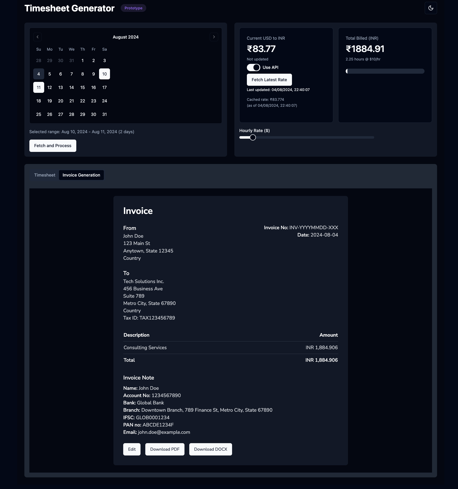
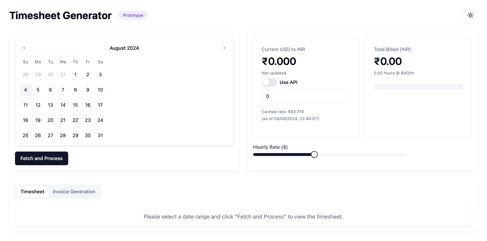
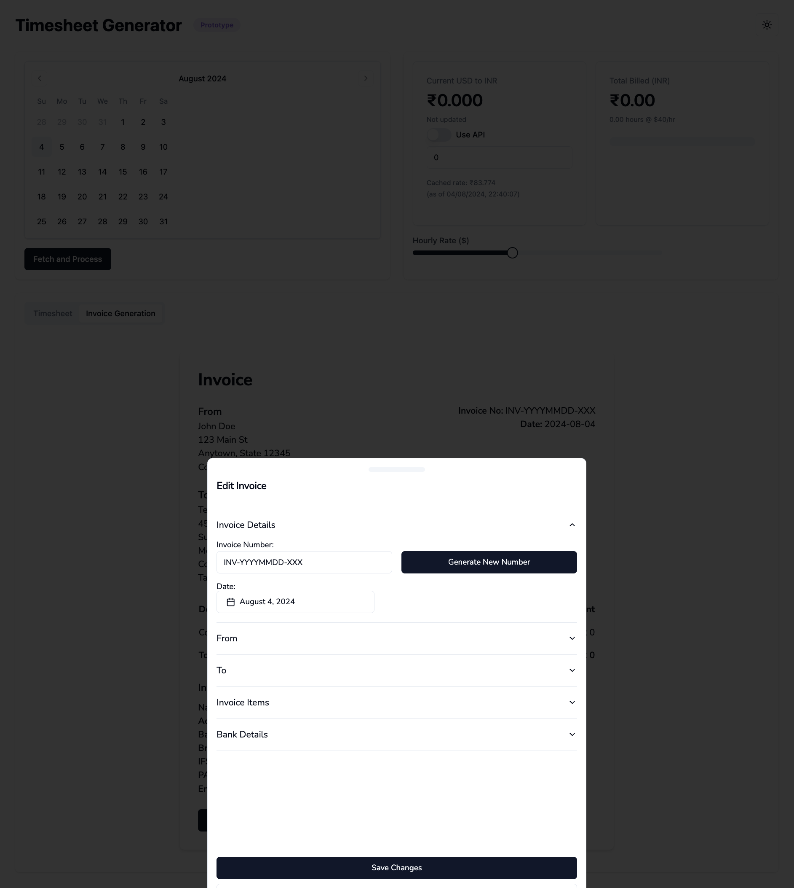
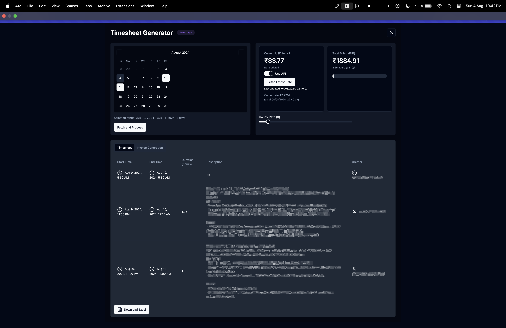

# GSuite Timesheet Generator

This project is a GSuite Timesheet Generator that automates the process of creating timesheets from Google Calendar events. It includes features for invoice generation and currency conversion.

## Screenshots






## Prerequisites

Before you begin, ensure you have met the following requirements:
* You have installed [Node.js](https://nodejs.org/) (version 14 or later)
* You have installed [pnpm](https://pnpm.io/)
* You have a Google account with Calendar access
* You have an OpenAI API key
* You have an Exchange Rate API key

## Installation

To install the GSuite Timesheet Generator, follow these steps:

1. Clone the repository:

```bash
git clone https://github.com/yourusername/gsuite-timesheet.git
cd gsuite-timesheet
```

2. Install the dependencies:
```bash
pnpm install
```

3. Set up the Google credentials:
- Follow the [Google instructions](https://developers.google.com/gmail/api/quickstart/python#authorize_credentials_for_a_desktop_application) to set up credentials for a desktop application.
- Once you've downloaded the credentials file, rename it to `credentials.json` and place it in the root directory of the project.

4. Create a `.env` file in the root directory and add your API keys:
```
OPENAI_API_KEY=your_openai_api_key_here
EXCHANGE_RATE_API_KEY=your_exchange_rate_api_key_here
```

## Running the Application

To run the GSuite Timesheet Generator, use the following command:

``` bash
pnpm run dev -- --open
```
This will start the development server and open the application in your default web browser. The application will be available at `http://localhost:5173/`.

## Features

- Fetch and display Google Calendar events
- Calculate total hours worked
- Generate invoices based on timesheet data
- Convert currency (USD to INR)
- Customize invoice details

## Contributing

Contributions to the GSuite Timesheet Generator are welcome. Please adhere to this project's `code of conduct`.

## License

This project uses the following license: [GNU GENERAL PUBLIC LICENSE](LICENSE)

## Contact

If you want to contact me, you can reach me at `rahul@ogha.ai`.